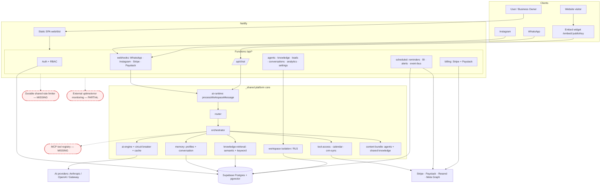

# Harbor AI (AI Business OS) — Deep Audit & Implementation Roadmap

**Audit date:** 2026-08-02
**Auditor:** Claude Code (direct codebase inspection)
**Method:** Direct file-by-file inspection of the `Agent folder` project. Findings are grounded in the actual code, not in any prior summary.

> ⚠️ **Note on the three-way comparison you requested.** You asked me to compare (1) the original question, (2) Kimi's response, and (3) the code. **Kimi's response file (`Untitled document (2).md`) is empty — 0 bytes.** There is nothing to compare against. This report therefore audits the *original requirements* directly against the *actual implementation*. If you can re-export Kimi's answer, I can do the head-to-head gap analysis you originally intended.

---

## Table of contents

1. [Executive Summary](#1-executive-summary)
2. [Overall Project Health Assessment](#2-overall-project-health-assessment)
3. [What the project actually is](#3-what-the-project-actually-is)
4. [Gap Analysis vs. the Original Requirements](#4-gap-analysis-vs-the-original-requirements)
5. [Prioritized Issues (Critical / High / Medium / Low)](#5-prioritized-issues)
6. [Architecture Review & Recommendations](#6-architecture-review--recommendations)
7. [Agent Review & Skill Matrix](#7-agent-review--skill-matrix)
8. [Skeletal Architecture Diagram](#8-skeletal-architecture-diagram)
9. [Milestone-Based Implementation Plan](#9-milestone-based-implementation-plan)
10. [Master Roadmap (8 Phases)](#10-master-roadmap-8-phases)
11. [Dependency Map](#11-dependency-map)
12. [Recommended Order of Execution](#12-recommended-order-of-execution)
13. [Production Readiness Checklist](#13-production-readiness-checklist)

---

## 1. Executive Summary

Harbor AI ("AI Business OS") is a **multi-tenant SaaS control plane for three specialist AI employees** — Reception, Sales, Marketing — sharing one "Company Brain," deployed on Netlify Functions + Supabase Postgres, with a React 19 SPA dashboard, an embeddable chat widget, and WhatsApp/Instagram channels.

**The good news:** the *product surface is broad and the security/runtime core is genuinely strong.* Three prior internal audits (security, agent-integrity, billing) each did real work — parameterized SQL, bcrypt+JWT auth, workspace tenant isolation, HMAC-verified webhooks, hybrid RAG, circuit breakers, and a working billing stack are all present and largely correct. This is **well beyond a typical MVP**.

**The bad news:** the project is suffering from **structural rot and drift** that a feature-level review misses. The most damaging issues are not missing features — they're *broken build/verification plumbing and multiple competing sources of truth*:

- The repo contains **167 MB of unrelated third-party projects** (`graphify`, `headroom`) vendored in with their own `.git` histories.
- **The working copy is not a git repository at all** — yet the docs describe a full CI/CD pipeline. None of it runs here.
- **The content build is broken** — the scripts that compile agent/knowledge content reference paths that no longer exist, so the "source of truth" for what the agents say can't be regenerated.
- **There are two competing definitions of the Reception agent** (`reception/` vs `receptionist/`), and the one you'd naturally edit is *dead at runtime*.
- **Root `npm` test scripts are broken** — they point at a `tests/` directory that doesn't exist.

The net effect: the app may well *run and demo correctly*, but the project is **not safely maintainable or verifiable** in its current state. Before adding anything new, the foundation needs to be made consistent, buildable, and testable.

**Overall completion estimate: ~70%** toward production-ready — feature-complete-ish, but held back by hygiene, consistency, and verification debt rather than missing capability.

---

## 2. Overall Project Health Assessment

| Dimension | Score | Notes |
|---|---|---|
| **Feature breadth** | 🟢 8.5/10 | Dashboard, agents, KB, conversations, leads, analytics, billing, integrations, embed widget all present |
| **Backend/runtime quality** | 🟢 8/10 | Solid pipeline: router → orchestrator → engine, circuit breaker, caching, hybrid RAG |
| **Security posture** | 🟢 8/10 | Prior audit fixed C1 + 5 highs; SQL/XSS/CSRF/JWT/webhooks in good shape |
| **Tenant isolation** | 🟢 8/10 | Workspace scoping + RLS config + tests |
| **Repo hygiene** | 🔴 2/10 | 167 MB of foreign repos, empty scaffolds, dead dirs, not a git repo |
| **Build/tooling integrity** | 🔴 3/10 | Broken content build + broken root test scripts + ~25 known type errors |
| **Consistency / single source of truth** | 🔴 3/10 | reception vs receptionist, catalog vs router, dual billing stacks |
| **Testing & verification** | 🟡 5/10 | Tests exist but can't be run via documented commands; evals advisory/non-deterministic |
| **Observability / ops** | 🟡 6/10 | Logger, redaction, health checks, runbooks exist; per-instance rate limiting |
| **Documentation** | 🟢 8/10 | Extensive docs/ — arguably over-documented relative to code consistency |
| **Scalability readiness** | 🟡 5/10 | Serverless-friendly, but per-instance rate limits, sequential BI jobs, 3.4k-line god file |

**Headline:** The engineering *inside* the core app is good. The engineering *around* it (repo structure, build, verification, single-source-of-truth) has decayed and is now the primary risk.

---

## 3. What the project actually is

### Core app (the real project — "Harbor AI / AI Business OS")

| Layer | Location | Purpose |
|---|---|---|
| Frontend SPA | `web/src/` (React 19 + Vite) | 19 pages: dashboard, agents, KB, conversations, leads, analytics, billing, integrations, settings, embed, auth |
| Serverless API | `web/netlify/functions/*.ts` (~55 functions) | Auth, chat, agents, knowledge, leads, billing, webhooks, scheduled jobs |
| Platform core | `web/netlify/functions/_shared/*.ts` (~75 modules) | Router, orchestrator, AI engine, RAG, memory, billing, RBAC, isolation |
| Agent behavior | `agents/*/agent.md` | Prompt/behavior definitions (compiled into a bundle) |
| Shared knowledge | `web/shared/*.md` + `workspace.profile.json` | The "Company Brain" default content |
| Database | `web/supabase/migrations/*.sql` (18 migrations) | Postgres schema |
| Tests | `web/tests/`, `web/src/lib/agent-tests/`, `evals/` | Security, isolation, logging, perf, embed, agent behavior, evals |
| Docs | `docs/`, plus 6 root `*_REPORT.md` files | Architecture, API, ops, user guides, prior audits |

### Clutter that does **not** belong to the project

| Item | Size | What it is |
|---|---|---|
| `graphify/` | 31 MB | Unrelated OSS ("Graphify-Labs/graphify") with its own `.git`, build artifacts, egg-info |
| `headroom/` | 136 MB | Unrelated OSS ("context compression layer for AI agents," chopratejas) — Rust + Python |
| `knowledge/` | tiny | 8 empty `.gitkeep` folders — dead scaffold; real knowledge is in `web/shared/` |
| `Agent file/` | empty | Empty directory |
| Root `scripts/generate-shared.mjs` | — | Reads a root `shared/` dir that does not exist — broken |

Neither `graphify` nor `headroom` is referenced anywhere in `web/`, `package.json`, or `netlify.toml`. They are pure weight (and a supply-chain/attack-surface liability sitting in your repo).

---

## 4. Gap Analysis vs. the Original Requirements

Your original prompt asked for 10 things. Here's how the *codebase* stacks up against each — independent of any Kimi answer.

| # | Requirement | Status in code | Gap |
|---|---|---|---|
| 1 | Full project analysis (every file, connections, redundancy) | ✅ Doable | This report covers it; **redundancy is severe** (see §3, §5) |
| 2 | Current project status / completion % | ✅ | ~70%; broken plumbing is the drag (see §2) |
| 3 | Critical issues ranked | ✅ | See §5; prior audits found real bugs but **new structural criticals remain** |
| 4 | Agent system review (per-agent responsibility, skills, overlaps) | ⚠️ Partial | 3 catalog agents + 1 orphan (`receptionist`) + 1 uncataloged (`bi`); overlap & drift (see §7) |
| 5 | Agent skill matrix (MCP, APIs, tools, memory, I/O) | ⚠️ Partial | Tools/memory exist but **no MCP layer**, no per-agent tool registry surfaced (see §7) |
| 6 | Architecture diagram (all components) | ✅ | Provided (§8); README already has a mermaid diagram |
| 7 | Missing components | ✅ | Monitoring, durable rate-limit, real analytics, MCP, plan-change flow (see §5) |
| 8 | Scalability review (thousands of users) | ⚠️ | Per-instance rate limits, sequential BI jobs, god-file DB layer (see §6) |
| 9 | Roadmap (immediate → long-term) | ✅ | See §9–§12 |
| 10 | Brutally honest assessment | ✅ | Delivered throughout — see especially §5 C-series and §6 |

**Biggest thing any surface-level review (including a hypothetical Kimi answer) would likely miss:** the content-build and reception/receptionist drift, and the fact that this isn't a git repo. These require actually *running* the scripts / tracing the runtime, not just reading files.

---

## 5. Prioritized Issues

Severity: 🔴 Critical · 🟠 High · 🟡 Medium · 🟢 Low

### 🔴 Critical

#### C1. Two competing Reception agents; the runtime uses the orphan, and the "nice" one is dead
- **Evidence:** `router.ts:131` maps `reception → agents/receptionist/agent.md` (used at runtime). `agents-catalog.ts` sets `promptPath: "agents/reception/agent.md"`. The content bundle (`content-bundle.ts`) contains **only** the `receptionist` key, not `reception`.
- **Why it's a problem:** `agents/reception/agent.md` is the cleaner, better-structured file — and editing it changes *nothing* in production. Meanwhile `receptionist/agent.md` (double-spaced, clearly machine-generated) is what customers actually get. Anyone maintaining prompts will edit the wrong file and ship no change.
- **Impact:** Silent prompt drift; wasted work; the live receptionist behavior can't be reasoned about from the "canonical-looking" source.
- **Fix:** Pick one canonical name (`reception`). Update `router.ts`, `agents-catalog.ts`, `sync-content.mjs`, and the bundle to agree. Delete the loser. Add a test asserting every `AgentId`'s `promptPath` resolves to a non-empty bundle entry.

#### C2. The content build is broken — the agents' "source of truth" can't be regenerated
- **Evidence:** `web/scripts/sync-content.mjs` reads from repo root: `shared/company.md`, `agents/receptionist/agent.md`, etc. But **root `shared/` does not exist** (knowledge lives in `web/shared/`), and it lists `receptionist` not `reception`. Separately, root `scripts/generate-shared.mjs` reads `shared/workspace.profile.json` at repo root — also missing (it's `web/shared/workspace.profile.json`).
- **Why it's a problem:** The runtime serves content **only** from `content-bundle.ts` (see `content-loader.ts:41`). That bundle is generated by a script that now throws on missing paths. So the bundle is frozen/stale and you cannot safely rebuild it.
- **Impact:** You have a compiled artifact you can't reproduce from source — the definition of unmaintainable. Knowledge/prompt edits require hand-editing a generated file.
- **Fix:** Consolidate to **one** content pipeline with correct paths, one source dir, one output bundle. Add it to `npm run build` and to a test that fails if the bundle is out of date (`git diff --exit-code` on regenerate).

#### C3. Repo is not a git repository, but ships a full CI/CD story
- **Evidence:** Environment reports `Is a git repository: false`. `.github/workflows/ci.yml` describes push/PR/tag pipelines; `DEPLOYMENT.md` + README describe staging/prod deploys.
- **Why it's a problem:** No version control = no history, no rollback, no branch protection, no CI gate, no `gitleaks` secret scan actually running. Every "CI/CD" claim in the docs is aspirational in this copy.
- **Impact:** No safety net for any of the changes this roadmap proposes; secret scanning and dependency audit never run.
- **Fix:** `git init`, add a proper root `.gitignore` (must exclude `node_modules`, `graphify`, `headroom`, `.env`, `dist`), make an initial commit, push to a remote, confirm Actions run.

#### C4. 167 MB of unrelated third-party repos vendored into the project
- **Evidence:** `graphify/` (31 MB, own `.git`) and `headroom/` (136 MB, own `.git`) are unrelated OSS projects, unreferenced by the app.
- **Why it's a problem:** Bloats clones/deploys, drags foreign `.git` histories, expands your license/security/supply-chain surface, and confuses any audit or agent that scans the tree (my own recursive `grep` timed out on them).
- **Impact:** Slower everything; audit noise; potential license contamination; accidental deploy inclusion.
- **Fix:** Remove both from the repo. If you need them, reference them as external tools/submodules *outside* this project. Do this **before** `git init` so they never enter history.

### 🟠 High

#### H1. Root `npm` test scripts point at a non-existent `tests/` directory
- **Evidence:** `package.json` → `test:security: "tsx tests/security.test.ts"` (and 3 more). Actual files are in `web/tests/`. No root `tests/` exists. CI runs `npm run test:all` at root.
- **Impact:** `npm run test:all` fails immediately; the CI "Unit & integration tests" step (which is *not* `continue-on-error`) would fail — meaning tests effectively never pass in CI.
- **Fix:** Correct the paths (`web/tests/...`) or move tests to a root `tests/`. Verify `npm run test:all` is green.

#### H2. Two parallel billing subsystems with divergent webhook handlers
- **Evidence:** `api/billing/webhook.ts` (209 lines, `/api/billing/webhook`, Stripe + idempotency — the canonical one per the billing audit) vs `billing/webhook.ts` (146 lines, `/.netlify/functions/billing/webhook`, a different, older implementation still deployed). Plus `billing.ts`, `billing-subscribe.ts`, `billing-subscribe-handler.ts`, `billing/initialize.ts`, `billing/verify.ts`, and Paystack/Stripe shims.
- **Why it's a problem:** Two live webhook endpoints with different logic can both receive events; the older one lacks the idempotency table. Duplicated subscribe flows drift.
- **Impact:** Inconsistent subscription state, possible double-processing on the legacy path, high maintenance cost.
- **Fix:** Choose one canonical Stripe path and one canonical Paystack path. Delete or hard-redirect the legacy `/.netlify/functions/billing/*` handlers. Document provider selection (region-based) instead of "Paystack auto-wins."

#### H3. ~25 known TypeScript errors in Netlify Functions (typecheck is advisory)
- **Evidence:** `ci.yml` runs functions typecheck with `continue-on-error: true` and a comment: "~25 pre-existing type errors in untouched functions."
- **Impact:** The most security-sensitive layer (serverless handlers) isn't type-safe; real bugs can hide behind the advisory flag.
- **Fix:** Burn down the 25 errors, then remove `continue-on-error` so the gate is real.

#### H4. In-memory rate limiting on serverless (per-instance, resets on cold start)
- **Evidence:** `_shared/rate-limit.ts` uses a module-level `Map`; prior audit M1.
- **Impact:** Real limits are `N × warm instances`; a burst across instances bypasses limits protecting **paid AI calls** and auth endpoints.
- **Fix:** Move counters to Postgres or Upstash Redis (durable, shared). Keep the in-memory path as an L1 cache.

#### H5. `bi` agent exists at runtime but is outside the type system
- **Evidence:** `agents/bi/agent.md`, `bi-agent.ts`, `bi.ts`, scheduled BI jobs — but `AgentId = "reception" | "sales" | "marketing"` and `agentPromptPath` has no `bi` entry.
- **Impact:** A whole agent lives in a blind spot: not in the catalog, not routable through the main pipeline, easy to break silently.
- **Fix:** Either promote BI to a first-class agent (add to `AgentId`, catalog, prompt map, tests) or explicitly scope it as an internal scheduled analytics service (rename modules `bi-service`, document it's not a chat agent).

### 🟡 Medium

- **M1. Analytics page still renders hardcoded template data** (`web/src/data/analytics.ts` → `AnalyticsPage.tsx`). Owners can mistake fixtures for real metrics. Derive from real conversation data or clearly label. *(Prior audit M4, still open.)*
- **M2. CORS `Allow-Origin: *` with `Allow-Credentials: true`** on all API responses (`auth-http.ts`). Dead/incorrect config; tighten to an allowlist for `/api/*`, keep `*` only on public `/api/chat`. *(Prior M2.)*
- **M3. Paystack pricing math** (`paystack-billing.ts:26` `priceMonthly * 10000`) charges ~₦900 (~$0.60) for the $9 plan; column named `amountCents` stores naira. Make `NGN_PER_USD` explicit; fix column naming. *(Prior M3.)*
- **M4. No in-place plan upgrade/downgrade with proration** (billing audit). Users can't change plans cleanly.
- **M5. Outdated model default** — catalog pins `gpt-4o-mini` for all agents. Revisit model strategy (per-agent model, current Claude/GPT models, cost tiering).
- **M6. Summary rolling is truncation-based, not LLM summarization** (`memory.ts`), degrading long-conversation memory. *(Agent-integrity remaining rec #1.)*
- **M7. No MCP layer** despite the product being an "agent platform." Tools are ad-hoc TS modules (`tool-access.ts`, `crm-sync.ts`, `calendar.ts`) with no standardized tool/permission registry.

### 🟢 Low

- **L1. `db.ts` is a 3,401-line god file.** Split by domain (`db/auth.ts`, `db/billing.ts`, …) before it hits 5k. *(Prior L1.)*
- **L2. Scheduled BI jobs iterate workspaces sequentially** — will hit function timeouts at hundreds of tenants. Add bounded concurrency. *(Prior L3.)*
- **L3. CSP `script-src` policy** — README/audit mention `'unsafe-inline'`, but current `netlify.toml` already uses `script-src 'self'`. **Verify and close** this item (may already be fixed). *(Prior M5 — appears resolved; confirm.)*
- **L4. Empty `knowledge/` scaffold and empty `Agent file/` dir** — delete to reduce confusion.
- **L5. Six root `*_REPORT.md` audit files** clutter the root. Move to `docs/audits/`.
- **L6. `fix-handler-syntax.mjs` in scripts/** suggests a past mechanical patch; confirm it's not needed as a permanent step and remove if one-off.

---

## 6. Architecture Review & Recommendations

### What's well-architected (keep)
- **Single message spine:** authenticated chat, embed widget, WhatsApp, and Instagram all converge on `processWorkspaceMessage` → `router` → `orchestrator` → `ai-engine`. This "do not fork the path" discipline is genuinely good.
- **Provider abstraction:** `ai-providers/` with Anthropic/OpenAI/Netlify + pricing + circuit breaker + fallback.
- **Tenant isolation** via workspace scoping + `set_config('app.workspace_id')` + tests.
- **Layer separation intent:** agents = behavior, `shared/` = facts, platform = orchestration.

### What should change

1. **Establish ONE content pipeline (foundational).** One source tree → one generator → one bundle → consumed at runtime → guarded by a "bundle is fresh" test. This kills C1/C2 permanently.
2. **Consolidate the function surface.** ~55 functions with several dead/duplicate/legacy variants. Introduce a convention: real handlers under `functions/api/<domain>/<action>.ts` with `config.path`; delete legacy `/.netlify/functions/billing/*`; keep shims only where a stable external URL (webhooks) requires it, each with a one-line comment.
3. **Split the `db.ts` god file** into a `db/` module per domain behind a barrel export. Mechanical, low-risk, big maintainability win.
4. **Durable, shared rate limiting** (Postgres or Redis) — required before "thousands of users."
5. **Introduce a real tool/skill registry (MCP or MCP-like).** Define tools once, attach per-agent allowlists, enforce in `tool-access.ts`. This is the backbone for the "skill matrix" you want and for future agents.
6. **Bounded-concurrency fan-out** for all per-workspace scheduled jobs (BI, alerts, event bus).
7. **Config-as-code for agents.** Replace the scattered `AgentId` union + `agentPromptPath` map + `AGENT_CATALOG` + `content-loader` knowledge map (four places that must agree) with **one** agent-registry module that every consumer imports.

### Redesign vs. patch verdict
**Patch, don't rewrite.** The backend core is sound; the problems are drift and plumbing. A rewrite would throw away good security/runtime work. The right move is *consolidation*: one content pipeline, one agent registry, one billing path per provider, one durable rate limiter.

### Recommended target folder structure (core app)
```
/ (git root)
├─ .github/workflows/         # CI actually runs (after git init)
├─ agents/                    # canonical agent behavior (reception, sales, marketing[, bi])
├─ shared/  → web/shared/     # ONE knowledge source (pick one location; delete empty knowledge/)
├─ web/
│  ├─ netlify/functions/
│  │  ├─ api/<domain>/<action>.ts   # canonical handlers only
│  │  ├─ scheduled/                 # cron jobs (bounded concurrency)
│  │  └─ _shared/
│  │     ├─ db/                     # split god file
│  │     ├─ agents/registry.ts      # single source of truth for agents
│  │     ├─ tools/registry.ts       # tool/skill + permission registry (MCP-ready)
│  │     └─ ...
│  ├─ src/                    # SPA
│  └─ tests/                  # tests (root scripts point here correctly)
├─ evals/
├─ docs/  (+ docs/audits/ for the *_REPORT.md files)
└─ scripts/                   # working, path-correct build/ops scripts
```

---

## 7. Agent Review & Skill Matrix

### Per-agent review

| Agent | Runtime status | Responsibility | Overlap / drift | Key gaps |
|---|---|---|---|---|
| **Reception** | Live (via `receptionist/agent.md` — C1) | Greet, FAQ, qualify, route | Two source files disagree | Canonical source; calendar tool wiring clarity |
| **Sales** | Live | Pitch, objections, close, recommend products | Shares product/pricing KB w/ reception | Real checkout/quote tool; CRM write |
| **Marketing** | Live | Captions, campaigns, content drafts | Tightened routing (won't grab greetings) | Publishing integrations are drafts-only by design — confirm |
| **BI** | Runs (scheduled) but **uncataloged** (H5) | Competitor monitoring, weekly reports | Outside `AgentId`/router | Type-system membership, catalog entry, or reclassify as service |
| **`receptionist` (orphan)** | Loaded at runtime, but a duplicate | — | Should not exist separately | Delete after merge into `reception` |
| **human_review** | Pseudo-agent (escalation target) | Human handoff | — | Fine as-is |

### Skill matrix (current vs. required)

| Agent | Current tools/skills | Memory | Knowledge sources | Missing tools | Missing MCP/APIs |
|---|---|---|---|---|---|
| Reception | Routing, RAG, lead capture, calendar (`calendar.ts`), boundary check | `conversation_memory` + `customer_profiles` (24-msg window) | company, faq, products, policies, brand_voice, sops, documents | Real booking/calendar write, escalation ticketing | Google/Microsoft Calendar MCP; ticketing (Zendesk/Freshdesk) |
| Sales | RAG, product recommend (`sales-agent.ts`), lead qualification, objection handling | same | company, products, pricing, faq, policies, brand_voice, sops | Quote generation, checkout link, CRM write (`crm-sync.ts` exists — verify wired) | Stripe payment-link, HubSpot/Salesforce MCP |
| Marketing | RAG, content drafts (`marketing-agent.ts`), campaign ideas | same | brand_voice, products, pricing, policies, sops, documents | Scheduling/publishing (intentionally draft-only?), asset gen | Social MCP (deferred posting), image-gen |
| BI | Competitor monitor, price-change detect, weekly report, robots-check | n/a (batch) | web sources | Bounded concurrency, alert routing | Search/scraping MCP, analytics warehouse |

**Cross-cutting gaps for all agents:** no unified tool/permission registry (MCP), no per-agent model selection, truncation-based long-term memory (M6), no citation-validation loop (agent-integrity rec #2).

---

## 8. Skeletal Architecture Diagram



---

## 9. Milestone-Based Implementation Plan

Milestones are ordered by dependency. **Backend/foundation first**, per your instruction. Each includes goal, rationale, files, outcome, risks-if-skipped, and a verification gate.

---

### Milestone 0 — Repo Hygiene & Version Control *(do this first, blocks everything)*

- **Goal:** A clean, versioned, buildable repo.
- **Why first:** You cannot safely make any other change without git history/rollback, and the 167 MB of foreign code poisons every scan, clone, and deploy.
- **Files/folders:** `graphify/`, `headroom/`, `knowledge/`, `Agent file/`, root `.gitignore`, new `.git`.
- **Tasks:**
  | Task | Why | Priority | Difficulty | Result |
  |---|---|---|---|---|
  | Remove `graphify/` and `headroom/` from the project | 167 MB of unrelated code + foreign `.git` (C4) | 🔴 | Easy | −167 MB, clean tree |
  | Delete empty `knowledge/` scaffold and `Agent file/` | Dead dirs cause "which is the source?" confusion | 🟢 | Easy | Less ambiguity |
  | Move root `*_REPORT.md` into `docs/audits/` | Root clutter (L5) | 🟢 | Easy | Clean root |
  | Write root `.gitignore` (node_modules, dist, .env, graphify, headroom) | Prevent junk entering history | 🔴 | Easy | Safe commits |
  | `git init` + initial commit + push to remote (C3) | No VC today | 🔴 | Easy | History + CI can run |
- **Outcome:** Versioned repo, ~170 MB lighter, CI/gitleaks can actually run.
- **Risk if skipped:** Every later change is unrecoverable; secret scanning never runs; deploys carry dead weight.
- **Verify:** `git status` clean; repo < 20 MB (excl. node_modules); `git log` shows the baseline; GitHub Actions triggers.

---

### Milestone 1 — Single Source of Truth for Agents & Content *(fixes C1, C2)*

- **Goal:** One agent registry, one content pipeline, one bundle — all in agreement.
- **Why now:** Until this is fixed, prompt/knowledge edits are unreliable; every agent change risks editing a dead file.
- **Files:** `agents/reception/*`, `agents/receptionist/*`, `router.ts`, `agents-catalog.ts`, `content-loader.ts`, `content-bundle.ts`, `web/scripts/sync-content.mjs`, `scripts/generate-shared.mjs`, `web/shared/`.
- **Tasks:**
  | Task | Why | Priority | Difficulty | Result |
  |---|---|---|---|---|
  | Choose canonical `reception`; merge best content; delete `receptionist` | C1 dead-file trap | 🔴 | Medium | One reception agent |
  | Create `_shared/agents/registry.ts` (id, name, model, promptPath, knowledge) as sole source | 4 files disagree today | 🔴 | Medium | Consumers import one module |
  | Repoint `router.ts`, `agents-catalog.ts`, `content-loader.ts` to the registry | Eliminate drift | 🔴 | Medium | Consistency |
  | Fix/consolidate content build (correct paths, one source dir, one output) | C2 broken build | 🔴 | Medium | Reproducible bundle |
  | Add test: every agent's promptPath → non-empty bundle entry; bundle-fresh check in CI | Prevent regression | 🟠 | Easy | Guardrail |
- **Outcome:** Editing an agent or knowledge file, running one command, regenerates the bundle deterministically.
- **Risk if skipped:** Permanent prompt drift; agents you can't reason about.
- **Verify:** Delete `content-bundle.ts`, run the build, `git diff` shows it regenerates identically; new test passes; reception behavior traces to the canonical file.

---

### Milestone 2 — Build & Test Integrity *(fixes H1, H3)*

- **Goal:** `npm run test:all` and typecheck are green and meaningful.
- **Files:** root `package.json`, `web/tsconfig.functions.json`, `.github/workflows/ci.yml`, `web/tests/*`.
- **Tasks:**
  | Task | Why | Priority | Difficulty | Result |
  |---|---|---|---|---|
  | Fix root test script paths (`web/tests/...`) | H1 broken commands | 🟠 | Easy | Tests run |
  | Burn down the ~25 function type errors | H3 unsafe layer | 🟠 | Medium-Hard | Type safety |
  | Remove `continue-on-error` from functions typecheck once clean | Make the gate real | 🟠 | Easy | Enforced |
  | Confirm `npm run eval` determinism or keep advisory + document | Evals hit real LLM | 🟡 | Medium | Trustworthy CI |
- **Outcome:** Green, trustworthy CI on every push.
- **Risk if skipped:** CI is theater; regressions ship silently.
- **Verify:** `npm run test:all` green locally and in Actions; `tsc -p tsconfig.functions.json` clean.

---

### Milestone 3 — Billing Consolidation *(fixes H2, M3, M4)*

- **Goal:** One canonical path per provider; correct money math; plan changes.
- **Files:** `api/billing/webhook.ts`, `billing/webhook.ts`, `billing.ts`, `billing-subscribe*.ts`, `billing/initialize.ts`, `billing/verify.ts`, `paystack-billing.ts`, `stripe-billing.ts`, shims.
- **Tasks:**
  | Task | Why | Priority | Difficulty | Result |
  |---|---|---|---|---|
  | Pick canonical Stripe webhook (`/api/billing/webhook` w/ idempotency); retire legacy `billing/webhook.ts` | H2 divergent handlers | 🟠 | Medium | One Stripe path |
  | Region-based provider selection (stop "Paystack auto-wins") | Predictable billing | 🟡 | Medium | Correct provider |
  | Fix Paystack `NGN_PER_USD` + `amountCents` naming | M3 wrong charges | 🟡 | Easy | Correct amounts |
  | Add Stripe subscription update (proration) for plan changes | M4 missing | 🟡 | Medium | Upgrade/downgrade |
- **Outcome:** Reliable, single-source billing with correct amounts and plan changes.
- **Risk if skipped:** Double-processed webhooks, wrong charges, no self-serve plan change.
- **Verify:** Simulated webhook hits only the canonical path; duplicate delivery is idempotent; test-mode upgrade prorates.

---

### Milestone 4 — Scalability Foundation *(fixes H4, L1, L2, M6)*

- **Goal:** Durable rate limiting, decomposed persistence, concurrent jobs.
- **Files:** `rate-limit.ts`, `embed-rate-limit.ts`, `db.ts`→`db/`, `scheduled/*`, `memory.ts`.
- **Tasks:**
  | Task | Why | Priority | Difficulty | Result |
  |---|---|---|---|---|
  | Move rate limiting to Postgres/Redis (shared) | H4 per-instance bypass | 🟠 | Medium | Real limits |
  | Split `db.ts` into `db/<domain>.ts` behind a barrel | L1 god file | 🟢 | Medium (mechanical) | Maintainable |
  | Bounded concurrency for scheduled fan-out | L2 timeouts at scale | 🟢 | Easy | Scales to 100s |
  | LLM-based summary rolling for long threads | M6 memory loss | 🟡 | Medium | Better recall |
- **Outcome:** Ready for real multi-tenant load.
- **Risk if skipped:** AI-cost abuse, timeouts, unmaintainable DB layer as tenants grow.
- **Verify:** Load test shows limits hold across instances; scheduled job completes for 200 mock workspaces under timeout.

---

### Milestone 5 — Agent Framework & Tooling (MCP) *(fixes H5, M5, M7)*

- **Goal:** First-class agent + tool/skill registry; per-agent models; MCP-ready.
- **Files:** new `_shared/tools/registry.ts`, `tool-access.ts`, `_shared/agents/registry.ts`, `crm-sync.ts`, `calendar.ts`, catalog.
- **Tasks:**
  | Task | Why | Priority | Difficulty | Result |
  |---|---|---|---|---|
  | Decide BI: promote to `AgentId` or reclassify as service | H5 blind spot | 🟠 | Medium | Clear status |
  | Build tool/permission registry; per-agent allowlists enforced in `tool-access.ts` | M7 no registry | 🟠 | Medium-Hard | Skill matrix real |
  | Per-agent model selection; refresh from `gpt-4o-mini` | M5 dated default | 🟡 | Easy | Right model per job |
  | MCP integration layer (calendar, CRM, search) behind the registry | Extensibility | 🟡 | Hard | Pluggable tools |
  | Citation-validation loop (verify citations ⊆ retrieved) | Anti-hallucination | 🟡 | Medium | Trustworthy answers |
- **Outcome:** New agents/tools plug in via one registry; MCP servers attach cleanly.
- **Risk if skipped:** Every new capability is bespoke and untracked; agent platform stays ad-hoc.
- **Verify:** Adding a mock tool + agent requires only registry edits; boundary/tool evals pass.

---

### Milestone 6 — Frontend Truth & UX *(fixes M1, M2)*

- **Goal:** No fake data; correct CORS.
- **Files:** `AnalyticsPage.tsx`, `src/data/analytics.ts`, `auth-http.ts`, `SystemHealthPage.tsx`/`AdminHealthPage.tsx`.
- **Tasks:**
  | Task | Why | Priority | Difficulty | Result |
  |---|---|---|---|---|
  | Replace/label hardcoded analytics with live data | M1 misleading metrics | 🟡 | Medium | Real analytics |
  | CORS allowlist for `/api/*`; keep `*` only on `/api/chat` | M2 dead/loose config | 🟡 | Easy | Tighter CORS |
  | Expose MRR (`getPlatformMrrCents`) in admin health | Revenue visibility | 🟢 | Easy | Ops insight |
- **Outcome:** Dashboard tells the truth; API CORS is scoped.
- **Verify:** Analytics reflects seeded conversations; embed widget still works post-CORS change.

---

### Milestone 7 — Testing, Security & Production Readiness

- **Goal:** Close remaining audit items; confirm CSP; add monitoring.
- **Tasks:** confirm CSP `unsafe-inline` is gone (L3 — appears already fixed in `netlify.toml`); wire external uptime/error monitoring (Sentry module exists — verify DSN/prod wiring); dunning emails for failed invoices; server-side KB item limits; expand eval determinism.
- **Verify:** Full `test:all` + evals green; security review clean; monitoring receives a test error.

---

## 10. Master Roadmap (8 Phases)

| Phase | Objective | Milestones | Deliverables | Success criteria |
|---|---|---|---|---|
| **1 — Foundation & Architecture** | Clean, versioned, consistent base | M0, M1 | Git repo, no foreign code, single agent/content source | Repo < 20 MB; bundle reproducible; one reception agent |
| **2 — Backend Cleanup** | Trustworthy build/test + billing | M2, M3 | Green CI, one billing path/provider | `test:all` green; idempotent webhooks; correct amounts |
| **3 — Agent Framework** | First-class agents + tool registry | M5 | Agent registry, tool/permission registry, MCP layer | New agent/tool via registry only; BI status resolved |
| **4 — Integrations & APIs** | External connectors via MCP | M5 (cont.) | Calendar/CRM/search MCP, per-agent models | Tools enforce allowlists; calendar write works |
| **5 — Frontend & UX** | Truthful, polished dashboard | M6 | Live analytics, scoped CORS, MRR in admin | No fixtures in prod UI |
| **6 — Testing & Security** | Real gates + monitoring | M2, M7 | Enforced typecheck, monitoring, dunning | 0 advisory gates; Sentry live |
| **7 — Optimization & Scalability** | Handle thousands of tenants | M4 | Durable rate limit, split db, concurrent jobs | Load test passes at target concurrency |
| **8 — Production Readiness** | Launch-grade | M7 | Runbook drills, backups verified, checklist green | §13 checklist 100% |

---

## 11. Dependency Map

```
M0 (hygiene + git)  ─────────────► everything (blocking)
  └─► M1 (single source: agents/content)
        ├─► M2 (build & test integrity)   [needs M1 so tests target canonical]
        │     └─► M3 (billing consolidation)
        ├─► M5 (agent framework + tools)   [needs M1 agent registry]
        │     └─► Phase 4 integrations (MCP)  [needs M5 registry]
        └─► M4 (scalability)               [independent of M3/M5; needs M0]
M6 (frontend truth)   ─► needs M2 (green build) ; benefits from M4 (real metrics infra)
M7 (security/prod)    ─► needs M2, M4, M6
```

**Critical path:** M0 → M1 → M2 → (M3 ∥ M5) → M4 → M6 → M7.

---

## 12. Recommended Order of Execution

1. **M0 — Hygiene & git** (today). Nothing is safe without it.
2. **M1 — Single source of truth** (this week). Fixes the most dangerous silent-failure class (C1/C2).
3. **M2 — Build & test integrity** (this week). Makes every later change verifiable.
4. **M3 — Billing consolidation** and **M5 — Agent framework** can proceed in parallel by different focuses once M1/M2 land.
5. **M4 — Scalability** before onboarding real volume.
6. **M6 — Frontend truth**, then **M7 — Security/monitoring/prod**.

**Immediate (today):** remove `graphify`/`headroom`, delete empty scaffolds, `git init` + `.gitignore` + first commit, fix root test-script paths.

---

## 13. Production Readiness Checklist

**Foundation**
- [ ] Repo under version control with remote + branch protection (C3)
- [ ] `graphify`/`headroom`/empty scaffolds removed; root `.gitignore` correct (C4)
- [ ] Single agent registry; `reception`/`receptionist` deduped (C1)
- [ ] Content bundle reproducible from source in CI (C2)

**Build / Test**
- [ ] `npm run test:all` green from root (H1)
- [ ] Functions typecheck clean; `continue-on-error` removed (H3)
- [ ] Evals deterministic or explicitly gated
- [ ] CI runs on push/PR/tag; gitleaks + dependency audit active

**Backend / Billing**
- [ ] One Stripe webhook path (idempotent); legacy retired (H2)
- [ ] Provider selection deterministic; Paystack amounts correct (M3)
- [ ] Plan upgrade/downgrade with proration (M4)

**Scalability**
- [ ] Durable shared rate limiting (H4)
- [ ] `db.ts` split by domain (L1)
- [ ] Scheduled jobs use bounded concurrency (L2)
- [ ] LLM summary rolling for long threads (M6)

**Agents / Tools**
- [ ] BI agent status resolved (H5)
- [ ] Tool/permission registry enforced; per-agent models (M5, M7)
- [ ] MCP integrations for calendar/CRM/search
- [ ] Citation validation loop

**Frontend / Ops / Security**
- [ ] No hardcoded analytics in prod (M1)
- [ ] CORS scoped to allowlist for `/api/*` (M2)
- [ ] CSP `unsafe-inline` confirmed removed (L3)
- [ ] External uptime + error monitoring wired (Sentry DSN in prod)
- [ ] Dunning emails on failed invoices
- [ ] Backup/restore drill executed against real Supabase
- [ ] `ADMIN_TOKEN`, `WHATSAPP_APP_SECRET`, `META_APP_SECRET` set in prod (fail-closed today)

---

## Appendix A — Verified facts (evidence trail)

| Claim | Evidence |
|---|---|
| Kimi response empty | `Untitled document (2).md` = 0 bytes |
| Not a git repo | Environment: `Is a git repository: false` |
| graphify/headroom foreign | `graphify/README.md` (Graphify-Labs), `headroom/README.md` (chopratejas); own `.git`; unreferenced in `web/`/`package.json`/`netlify.toml`; 31 MB / 136 MB |
| Reception dead file | `router.ts:131` → `receptionist`; bundle lacks `reception` key; `agents-catalog.ts` → `reception` |
| Content build broken | `sync-content.mjs` reads root `shared/` (absent) + `receptionist`; `generate-shared.mjs` reads absent root `shared/workspace.profile.json` |
| Root test scripts broken | `package.json` → `tests/*.test.ts`; actual files in `web/tests/` |
| BI uncataloged | `agents-catalog.ts` `AgentId` excludes `bi`; `agentPromptPath` has no `bi` |
| Dual billing webhooks | `api/billing/webhook.ts` (209 ln, `/api/billing/webhook`) vs `billing/webhook.ts` (146 ln, `/.netlify/functions/billing/webhook`) |
| ~25 type errors | `ci.yml` functions typecheck `continue-on-error: true` w/ comment |
| Runtime uses bundle only | `content-loader.ts:41` `bundledContent[relativePath] ?? ""` |

## Appendix B — Not verified / out of scope this pass
- I did **not** run the app or connect a database (no DB in this copy; dev preview mode exists).
- I did **not** exhaustively read all ~75 `_shared` modules or all 19 SPA pages — I traced the critical paths and sampled the rest.
- Prior audit "FIXED" claims (SQL injection, XSS, JWT, webhook HMAC) were spot-checked, not re-proven end-to-end.
- Kimi's answer could not be compared (empty file).
