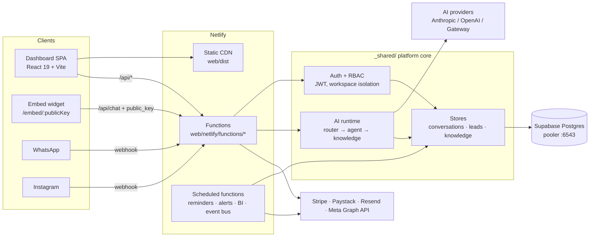

# AI Business OS

Multi-tenant SaaS control plane for three specialist AI employees — **Reception**, **Sales**, and **Marketing** — sharing one **Company Brain**. Businesses connect their website, WhatsApp, and Instagram; the agents answer customers, capture leads, and report back through a live dashboard.

**Production:** https://harbor-ai-business-os.netlify.app

## Quick start

```bash
npm install && (cd web && npm install)
cp .env.example .env        # fill in DATABASE_URL + AUTH_SECRET + an AI key
npm run dev
```

- App: http://localhost:5173/app (sign in required) · Register: http://localhost:5173/register · Public demo: http://localhost:5173/
- No database yet? Use dev preview mode — see [DEPLOYMENT.md §1](DEPLOYMENT.md#1-local-development-setup).

## Documentation map

| Doc | Contents |
| --- | --- |
| [API.md](API.md) | Full API reference — every endpoint, auth, rate limits, examples |
| [docs/api/openapi.yaml](docs/api/openapi.yaml) | OpenAPI 3.1 spec (import into Postman/Insomnia) |
| [DEPLOYMENT.md](DEPLOYMENT.md) | Clone→running, env vars, DB migrations, Netlify + alternatives, DNS/SSL |
| [CONTRIBUTING.md](CONTRIBUTING.md) | Coding standards, tests, PR process |
| [docs/core-architecture.md](docs/core-architecture.md) | Architecture blueprint + component/sequence diagrams |
| [docs/modules.md](docs/modules.md) | Module-by-module reference (what every directory and `_shared/` module does) |
| [docs/user/getting-started.md](docs/user/getting-started.md) | User guide: account → first agent → first conversation |
| [docs/user/features.md](docs/user/features.md) | Feature guide for every dashboard page |
| [docs/user/troubleshooting.md](docs/user/troubleshooting.md) · [faq.md](docs/user/faq.md) | Common issues · 20+ FAQs |
| [docs/ops/runbook.md](docs/ops/runbook.md) | Incident runbooks + escalation |
| [docs/ops/backup-and-recovery.md](docs/ops/backup-and-recovery.md) | Backups, PITR, disaster recovery, data export |
| [docs/security.md](docs/security.md) · [docs/PERFORMANCE.md](docs/PERFORMANCE.md) | Security posture · performance report |
| [docs/product-requirements.md](docs/product-requirements.md) · [PRODUCT.md](PRODUCT.md) | PRD · product register & design principles |

## Architecture



Full component boundaries and the message lifecycle sequence diagram: [docs/core-architecture.md](docs/core-architecture.md).

### The rule that keeps this codebase sane

- **Agents** = behavior only (`agents/*/agent.md`)
- **Shared knowledge** = facts (`shared/`, compiled per workspace)
- **Platform** = routing + isolation + orchestration (`web/netlify/functions/_shared/`)

Authenticated and public-key chat both flow through `processWorkspaceMessage` → router → agent → knowledge. Do not fork this path.

## Product surface

| Area | Route | Notes |
| --- | --- | --- |
| Dashboard | `/app` | Live metrics from the AI runtime |
| My Agents | `/app/agents` | Toggle, notes, test chat per agent |
| Knowledge Base | `/app/knowledge` | Items + document upload (PDF/DOCX/TXT) |
| Conversations | `/app/conversations` | Live threads, resolve action |
| Leads | `/app/leads` | Auto-captured from AI chats |
| Analytics | `/app/analytics` | KPIs + charts |
| Integrations | `/app/integrations` | Website embed, WhatsApp, Instagram |
| Settings | `/app/settings` | Profile, workspace, notifications, key rotation |
| Billing | `/app/billing` | Plans: Free / Starter $9 / Growth $29 / Pro $79 |
| Embed widget | `/embed/:publicKey` | Frameable tenant chat widget |

## Scripts

```bash
npm run dev / build          # app (proxies to web/)
npm run test:all             # security + tenant-isolation + logging + perf suites
npm run eval                 # agent behavior evals
npm run loadtest             # p50/p95/p99 load test
node scripts/health-check.mjs <url>       # deployed-site smoke check
node scripts/backup-database.mjs          # pg_dump backup (see ops docs)
node scripts/export-workspace-data.mjs    # per-customer data export
```

## CI/CD

GitHub Actions ([.github/workflows/ci.yml](.github/workflows/ci.yml)): typecheck + tests + security scan on push, build + bundle budget on PRs, `main` → staging deploy, `v*` tags → production. Details in [DEPLOYMENT.md](DEPLOYMENT.md) and [CONTRIBUTING.md](CONTRIBUTING.md).
