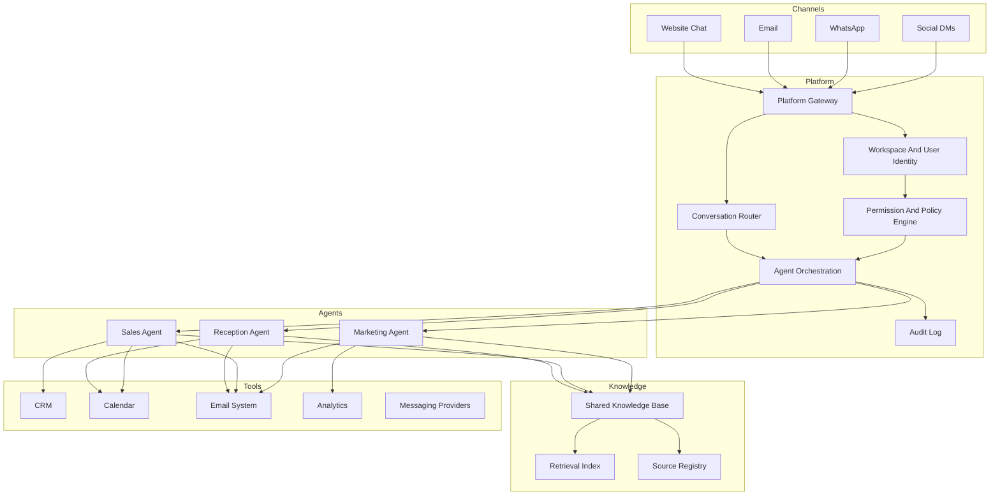
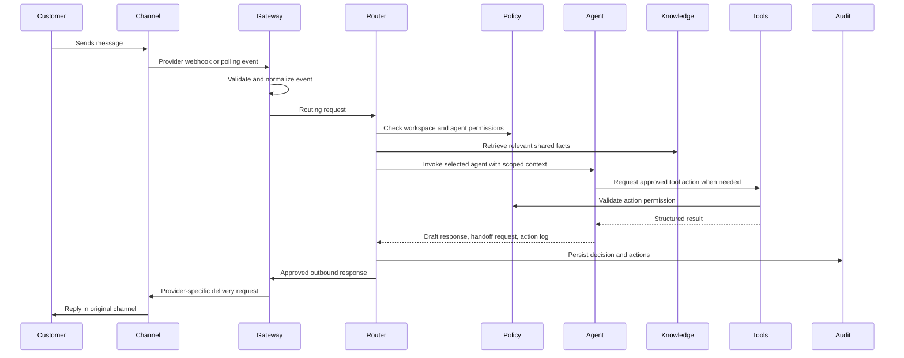

# Core Architecture Blueprint

## Purpose

This document defines the production architecture for a modular AI Business OS. The system separates platform orchestration, specialist agents, shared knowledge, approved tools, and customer channels so each part has a clear owner and testable contract.

## Architecture Overview

## Component Boundaries

### Channels

Channels own transport-specific details only. Each channel adapter converts inbound events into the platform routing contract and converts outbound responses back into the native channel format.

Channel adapters must handle:

- Authentication and webhook validation for the provider.
- Provider-specific message IDs, thread IDs, attachments, and delivery receipts.
- Rate limits and retries for the provider.
- Mapping channel capabilities into normalized message capabilities.

Channel adapters must not:

- Decide which agent should answer a conversation.
- Store business facts outside the shared knowledge system.
- Call CRM, calendar, analytics, or email tools directly for agent work.

### Platform

The platform owns product behavior that is not specific to one agent. It is responsible for workspace isolation, routing, permissions, tool mediation, auditability, and lifecycle state.

Platform responsibilities:

- Normalize all channel events into a single internal contract.
- Authenticate users, workspaces, channel installations, and tool connections.
- Route each conversation turn to the correct agent.
- Enforce each agent's allowed tools and forbidden actions.
- Store conversation state, handoff state, action logs, and audit records.
- Apply billing limits, rate limits, workspace settings, and feature flags.
- Mediate outbound actions before messages or tool writes are committed.

The platform is the only layer that may move a conversation between agents. Agents can request handoff, but they do not directly invoke each other.

### Agents

Agents own role-specific reasoning and response drafting. Each agent receives a narrow system prompt, the normalized message, scoped workspace context, relevant shared knowledge snippets, and only the tool handles approved for that role.

Agent responsibilities:

- Stay inside the agent's assigned job.
- Use shared knowledge for business facts.
- Request handoff when user intent moves outside the agent boundary.
- Produce a response draft and structured action log.
- Explain uncertainty when shared knowledge is missing or contradictory.

Agents must not:

- Invent or duplicate company facts in their own prompt files.
- Bypass the platform router or policy engine.
- Use tools not granted for the current turn.
- Negotiate policies, pricing, or commitments unless that responsibility belongs to the assigned role and the relevant facts exist in shared knowledge.

### Shared Knowledge

Shared knowledge is the source of truth for reusable company facts. It includes products, services, pricing, FAQs, policies, brand voice, opening hours, guarantees, exclusions, and approved claims.

Knowledge responsibilities:

- Store reusable facts once and make them retrievable by all agents.
- Track ownership, source, freshness, and approval status for each knowledge item.
- Separate stable facts from campaign drafts, conversation notes, and tool records.
- Provide citations or source references for agent responses where useful.

Agent-specific behavior belongs in agent files. Durable business facts belong in shared knowledge.

### Tools

Tools expose controlled capabilities to agents through platform-mediated adapters. Tool access is granted by agent role, workspace permissions, and conversation state.

Tool responsibilities:

- Provide typed actions and read operations for CRM, calendar, email, analytics, and messaging systems.
- Return structured results with success, failure, retry, and permission states.
- Require idempotency keys for write operations.
- Emit audit events for every external read or write.

Tools must not:

- Make routing decisions.
- Contain agent prompts or business facts.
- Allow direct agent access to unmanaged provider SDKs.

## Message Lifecycle

## Internal Ownership Rules

- Platform owns control flow, identity, permissions, routing, tenant isolation, billing, and auditability.
- Agents own specialized conversation behavior and role-specific decisions.
- Shared knowledge owns reusable business facts and approved brand language.
- Tools own external system capabilities through typed, audited adapters.
- Channels own provider-specific transport details and message formatting.

## Reliability Requirements

- Every inbound event must be idempotent by channel event ID and workspace ID.
- Every routing decision must include the selected agent, confidence, reason, and fallback behavior.
- Every tool write must include a requester, agent role, idempotency key, and audit record.
- Every response must be traceable to the conversation turn, agent, knowledge snippets, and tool results used.
- Every handoff must preserve user-visible context and internal action history.

## Security And Privacy Requirements

- Workspaces are isolated at every data access boundary.
- Agents receive only the conversation, knowledge, and tools needed for the current turn.
- Provider credentials are stored and used by platform tool adapters, never by agent prompt code.
- Sensitive customer data must be redacted from model logs unless explicitly required for the task.
- Tool results are filtered before being returned to agents when they include unnecessary private fields.

## Initial Repository Map

- `platform/`: routing contract, workspace identity, channel adapters, orchestration, permissions, and audit workflows.
- `agents/`: agent role definitions, allowed tools, forbidden behaviors, and handoff rules.
- `knowledge/`: shared knowledge model, ownership rules, source registry, and content structure.
- `tools/`: CRM, calendar, email, analytics, and messaging tool contracts. See `tools/README.md`.
- `evals/`: routing, knowledge consistency, boundary enforcement, and regression tests.
