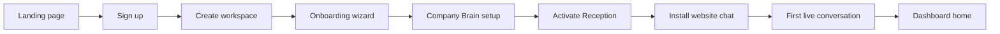
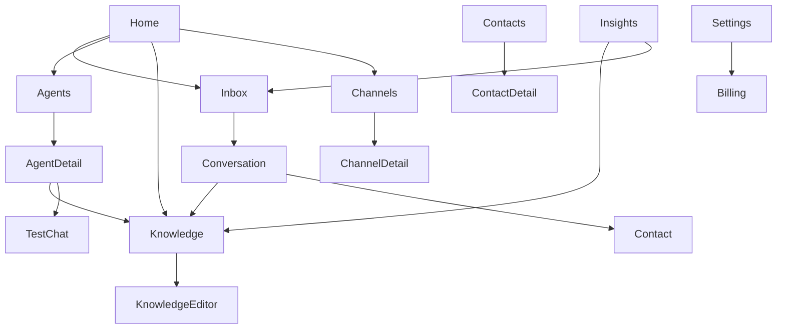

# AI Business OS — Product Requirements Document

**Product:** AI Business OS  
**Audience:** SME business owners who want AI employees for reception, sales, and marketing  
**Document type:** Application structure & product design (no implementation)  
**Status:** Design baseline for SaaS UI/UX and information architecture  

**Non-goals for this document**

- Do not redesign the AI architecture.
- Reception, Sales, and Marketing agents remain specialist workers.
- Shared Knowledge remains the single source of truth for company facts.
- Platform routing, handoffs, and agent boundaries stay as defined in existing contracts.

---

## 1. Product summary

AI Business OS is a multi-tenant SaaS platform where a business owner hires three AI employees:

| AI employee | Job |
| --- | --- |
| Reception Agent | Welcome visitors, answer FAQs, collect intake, route conversations |
| Sales Agent | Recommend products, handle objections, qualify leads, encourage checkout |
| Marketing Agent | Captions, campaigns, promotions, brand-aligned content drafts |

All three share one **Company Brain** (Shared Knowledge). Owners edit facts once; agents never invent business truth.

The product’s job is not “chat with an LLM.” It is:

1. Set up the business brain.
2. Turn on AI employees.
3. Connect customer channels.
4. Monitor conversations and handoffs.
5. Improve answers and outcomes over time.

---

## 2. Primary user and jobs-to-be-done

### Primary user

**Business owner / operator** of an SME (solo founder, small team, or ops manager).

### Secondary users (later)

| Role | Access |
| --- | --- |
| Owner | Full access, billing, agents, knowledge, channels |
| Admin | Same as owner except billing |
| Staff | Conversations, limited knowledge edits, no billing |
| Viewer | Read-only dashboard and conversations |

MVP focuses on **Owner** only.

### Jobs to be done

1. “I want customers answered 24/7 without hiring a receptionist.”
2. “I want sales questions handled without inventing prices.”
3. “I want marketing drafts that sound like my brand.”
4. “I want one place to update hours, products, and policies.”
5. “I want to see what my AI employees did and when they need me.”

---

## 3. Complete user journey

### 3.1 Acquisition → first value



| Stage | User goal | Success moment |
| --- | --- | --- |
| Discover | Understand product in 30 seconds | “AI employees for reception, sales, marketing” |
| Sign up | Create account quickly | Email/password or Google OAuth |
| Create workspace | Name their business | Workspace exists |
| Onboard | Fill Company Brain essentials | Company, hours, contact, 1 product, 3 FAQs |
| Activate agent | Turn on Reception first | Reception status = Active |
| Connect channel | Add website chat widget | Widget snippet copied / installed |
| First win | Customer asks hours or books interest | Conversation appears in inbox |
| Habit | Return daily to review and improve | Dashboard shows activity + tasks |

### 3.2 Steady-state weekly loop

1. Check **Home** for alerts (human review, missing knowledge, failed sends).
2. Review **Inbox** conversations and approve handoffs.
3. Update **Company Brain** when prices/policies change.
4. Tune **Agents** (tone notes, enable Sales/Marketing when ready).
5. Review **Insights** (volume, handoff rate, unanswered topics).
6. Manage **Channels** and **Settings** as the business grows.

### 3.3 Expansion path

Reception only → add Sales → add Marketing → add email/WhatsApp → invite staff → upgrade plan.

---

## 4. Information architecture & navigation

### 4.1 App shell (authenticated)

**Top bar**

- Workspace switcher (future multi-workspace)
- Global search (conversations, knowledge, contacts)
- Notifications
- Account menu (profile, billing, logout)

**Left sidebar (primary nav)**

| Nav item | Route | Purpose |
| --- | --- | --- |
| Home | `/app` | Command center / overview |
| Inbox | `/app/inbox` | All customer conversations |
| Agents | `/app/agents` | Reception, Sales, Marketing status & config |
| Company Brain | `/app/knowledge` | Shared knowledge editor |
| Channels | `/app/channels` | Website chat, email, WhatsApp, social |
| Leads & Contacts | `/app/contacts` | People captured by agents |
| Insights | `/app/insights` | Performance and gaps |
| Settings | `/app/settings` | Workspace, team, billing, security |

**Secondary / utility**

| Item | Route |
| --- | --- |
| Help / Docs | `/help` |
| Billing | `/app/settings/billing` |
| Public marketing site | `/` (unauthenticated) |

### 4.2 Navigation principles

- Owner lands on **Home**, not a blank chat.
- **Inbox** is the operational heart (like Intercom/Front).
- **Company Brain** is always one click away (facts change often).
- **Agents** are employees, not buried under “AI settings.”
- Settings never hold day-to-day work.

---

## 5. Dashboard layout (Home)

Home is a **command center**, not a vanity analytics wall.

### Layout (desktop)

```text
┌─────────────────────────────────────────────────────────────┐
│ Top bar: Workspace · Search · Notifications · Account       │
├──────────┬──────────────────────────────────────────────────┤
│ Sidebar  │ Page header: Good morning, {Name}                │
│          │                                                  │
│ Home     │ ┌────────┐ ┌────────┐ ┌────────┐ ┌────────┐     │
│ Inbox    │ │ Needs  │ │ Open   │ │ Leads  │ │ Agent  │     │
│ Agents   │ │ you    │ │ chats  │ │ today  │ │ health │     │
│ Brain    │ └────────┘ └────────┘ └────────┘ └────────┘     │
│ Channels │                                                  │
│ Contacts │ ┌─────────────────────┐ ┌─────────────────────┐ │
│ Insights │ │ Needs attention     │ │ Agent status        │ │
│ Settings │ │ (human review,      │ │ Reception ● Active  │ │
│          │ │  missing knowledge) │ │ Sales ○ Setup       │ │
│          │ └─────────────────────┘ │ Marketing ○ Setup   │ │
│          │                         └─────────────────────┘ │
│          │ ┌─────────────────────────────────────────────┐ │
│          │ │ Recent conversations                        │ │
│          │ └─────────────────────────────────────────────┘ │
│          │ ┌─────────────────────┐ ┌─────────────────────┐ │
│          │ │ Setup checklist     │ │ Quick actions       │ │
│          │ └─────────────────────┘ └─────────────────────┘ │
└──────────┴──────────────────────────────────────────────────┘
```

### Home information blocks

| Block | Contents |
| --- | --- |
| KPI strip | Needs you, open conversations, leads today, agent health |
| Needs attention | Human review queue, knowledge gaps, failed channel events |
| Agent status | Active / paused / setup incomplete per agent |
| Recent conversations | Last 5–10 threads with agent badge and channel |
| Setup checklist | Incomplete onboarding steps with deep links |
| Quick actions | Edit Company Brain, open Inbox, install chat widget |

---

## 6. Complete page inventory

### A. Public / pre-auth

| Page | Route | Purpose | Key information |
| --- | --- | --- | --- |
| Marketing landing | `/` | Convert visitors to signup | Value prop, 3 agents, how Company Brain works, pricing teaser, CTA |
| Pricing | `/pricing` | Plan comparison | Free/trial, Starter, Growth, features, limits |
| Login | `/login` | Authenticate | Email/password, OAuth, forgot password |
| Sign up | `/signup` | Create account | Email, password, business name |
| Password reset | `/reset-password` | Recover access | Email → reset link |
| Legal | `/privacy`, `/terms` | Compliance | Privacy policy, terms of service |

### B. Onboarding (first-run only, dismissible)

| Page | Route | Purpose | Key information |
| --- | --- | --- | --- |
| Welcome | `/onboarding` | Orient owner | What AI Business OS does in 3 bullets |
| Company basics | `/onboarding/company` | Seed Company Brain | Name, mission, hours, location, contact |
| Products & pricing | `/onboarding/products` | Seed offerings | At least 1 product + price |
| FAQs & policies | `/onboarding/faqs` | Seed support facts | Top FAQs, refund/returns summary |
| Brand voice | `/onboarding/brand` | Seed tone | Professional/friendly/confident/helpful toggles + sample phrases |
| Activate Reception | `/onboarding/agents` | First employee live | Enable Reception; Sales/Marketing optional |
| Connect website chat | `/onboarding/channel` | First channel | Widget snippet, install instructions, test chat |
| Done | `/onboarding/complete` | Celebrate first value | Link to Home + Inbox |

Owners can skip non-critical steps but must complete **company name + contact + activate Reception** to leave onboarding.

### C. Core application pages

#### C1. Home

| Field | Detail |
| --- | --- |
| Route | `/app` |
| Purpose | Daily command center |
| Information | KPIs, needs attention, agent status, recent threads, setup checklist, quick actions |
| Primary actions | Resolve alert, open conversation, continue setup |

#### C2. Inbox (conversation list)

| Field | Detail |
| --- | --- |
| Route | `/app/inbox` |
| Purpose | Operate all customer conversations across channels |
| Information | Thread list: customer name/handle, channel icon, active agent badge, last message preview, status (open / waiting / human review / closed), timestamp |
| Filters | Channel, agent, status, date, unread |
| Primary actions | Open thread, assign to human, close, search |

#### C3. Conversation detail

| Field | Detail |
| --- | --- |
| Route | `/app/inbox/:conversationId` |
| Purpose | Read full thread, intervene, approve handoffs |
| Information | Message timeline, which agent replied, citations from Shared Knowledge, handoff events, collected fields (name, email, interest), channel metadata |
| Side panel | Contact card, agent path (Reception → Sales), knowledge used, action log |
| Primary actions | Reply as human, take over, release back to agent, force handoff, mark resolved |

#### C4. Agents overview

| Field | Detail |
| --- | --- |
| Route | `/app/agents` |
| Purpose | Manage AI employees as a team |
| Information | Cards for Reception, Sales, Marketing: status, conversations handled, handoff rate, last active |
| Primary actions | Open agent detail, activate/pause agent |

#### C5. Agent detail (one page pattern × 3)

| Field | Detail |
| --- | --- |
| Routes | `/app/agents/reception`, `/app/agents/sales`, `/app/agents/marketing` |
| Purpose | Configure one specialist without editing architecture contracts |
| Information | Role summary (from agent.md), mission checklist, tone, allowed handoffs, recent examples, performance mini-stats |
| Tabs | Overview · Behavior notes · Activity · Test chat |
| Primary actions | Activate/pause, save behavior notes, run test conversation |
| Explicit constraint | Owner edits **behavior preferences**, not product facts. Facts stay in Company Brain. |

#### C6. Company Brain (Shared Knowledge hub)

| Field | Detail |
| --- | --- |
| Route | `/app/knowledge` |
| Purpose | Single place to edit facts all agents use |
| Information | Cards/list for each knowledge area with completeness indicators |
| Sections | Company, Products, Pricing, FAQ, Brand Voice, Policies, SOPs |
| Primary actions | Open section editor, publish changes, view “last updated” |

#### C7. Knowledge section editor

| Field | Detail |
| --- | --- |
| Routes | `/app/knowledge/company`, `/products`, `/pricing`, `/faq`, `/brand-voice`, `/policies`, `/sops` |
| Purpose | Edit one knowledge domain with guided fields (not raw files for default UX) |
| Information | Structured form matching Step 2 fields; optional Advanced markdown view |
| Primary actions | Save, preview how agents will use it, restore previous version (later) |

**Field mapping (must match existing Shared Knowledge model)**

| Page | Fields |
| --- | --- |
| Company | Name, Mission, Vision, Business Description, Operating Hours, Locations, Contact |
| Products | Product list: Description, Benefits, Available Colours, Warranty, Delivery |
| Pricing | Product prices, Discounts, Payment Methods |
| FAQ | General FAQs, Shipping, Returns, Delivery, Payments, Support |
| Brand Voice | Professional, Friendly, Confident, Helpful, Short answers, Never argue |
| Policies | Refund, Privacy, Warranty, Returns, Escalation Rules |
| SOPs | Intake fields, qualification fields, handoff process notes |

#### C8. Channels overview

| Field | Detail |
| --- | --- |
| Route | `/app/channels` |
| Purpose | Connect where customers talk |
| Information | Channel cards: Website Chat, Email, WhatsApp, Social DMs — connected / not connected |
| Primary actions | Connect, configure, pause channel |

#### C9. Channel detail — Website Chat (MVP priority)

| Field | Detail |
| --- | --- |
| Route | `/app/channels/website-chat` |
| Purpose | Install and configure embeddable chat |
| Information | Install snippet, allowed domains, greeting message, default agent (Reception), widget appearance, test link |
| Primary actions | Copy snippet, save config, open test page |

#### C10. Channel detail — Email / WhatsApp / Social (post-MVP)

| Field | Detail |
| --- | --- |
| Routes | `/app/channels/email`, `/whatsapp`, `/social` |
| Purpose | Provider connection and delivery constraints |
| Information | Auth status, phone/inbox, templates, consent flags |
| Primary actions | Connect provider, verify, pause |

#### C11. Leads & Contacts

| Field | Detail |
| --- | --- |
| Route | `/app/contacts` |
| Purpose | People and leads captured by agents (tool/CRM layer, not Shared Knowledge) |
| Information | Name, email/phone, source channel, stage (new / qualified / proposal), owner agent, last contact |
| Primary actions | Open contact, export, mark stage |

#### C12. Contact detail

| Field | Detail |
| --- | --- |
| Route | `/app/contacts/:id` |
| Purpose | Full person record + conversation history |
| Information | Profile fields, timeline of chats, notes, handoff summaries |
| Primary actions | Message, edit fields, link conversations |

#### C13. Insights

| Field | Detail |
| --- | --- |
| Route | `/app/insights` |
| Purpose | Understand performance and knowledge gaps |
| Information | Conversation volume by channel/agent, handoff rates, human review rate, top unanswered topics, FAQ hit rate |
| Primary actions | Drill into topic → create/edit knowledge item |

#### C14. Settings

| Field | Detail |
| --- | --- |
| Route | `/app/settings` |
| Purpose | Workspace administration |
| Sections | Profile, Workspace, Team (later), Notifications, Billing, API/keys (later), Danger zone |
| Information | Owner profile, workspace name, timezone, notification preferences, plan & invoices |
| Primary actions | Update profile, change plan, invite teammate (later) |

### D. System / edge pages

| Page | Purpose |
| --- | --- |
| Human review queue (`/app/inbox?status=human_review`) | Filtered inbox for escalations |
| Empty states | Guide setup when no conversations/knowledge yet |
| 404 / error | Recoverable errors with support path |
| Maintenance | Planned downtime notice |

---

## 7. User flows between pages

### Flow 1 — First-time owner

`Landing → Sign up → Onboarding (Company → Products → FAQ → Brand → Activate Reception → Website Chat) → Home`

### Flow 2 — Answer a customer (steady state)

`Home (alert) → Inbox → Conversation detail → (optional) Company Brain edit → back to Conversation`

### Flow 3 — Price change

`Home / Agents → Company Brain → Pricing → Save → Inbox (agents use new prices on next turn)`

### Flow 4 — Turn on Sales

`Agents → Sales detail → Activate → Company Brain completeness check (products + pricing required) → Test chat → Home`

### Flow 5 — Marketing draft request (internal)

`Agents → Marketing → Test chat / Campaign workspace (later) → Draft saved → Human approval`

### Flow 6 — Complaint escalation

`Inbox conversation (Reception) → Handoff to human review → Owner notified on Home → Conversation detail → Owner replies`

### Flow 7 — Knowledge gap discovered

`Insights (unanswered topic) → Company Brain FAQ/Products → Save → Future conversations improve`



---

## 8. Role of existing AI architecture (unchanged)

The SaaS UI is a control plane around the existing system:

| Existing asset | Product surface |
| --- | --- |
| Reception / Sales / Marketing `agent.md` | Agents pages (behavior presentation + preferences) |
| `shared/*` Company Brain | Company Brain pages |
| Platform router | Invisible; shown as agent badges and handoff timeline |
| Handoff contract | Inbox events + “Needs you” queue |
| Channel adapters | Channels pages |
| Tools (CRM, calendar, email) | Contacts + future integrations settings |
| Evals | Internal quality; optional “Health” badge on Agents |

**Hard product rules (SaaS UX must enforce)**

1. Never let owners paste product facts into agent behavior notes.
2. Company Brain is the only place for prices, policies, FAQs, products.
3. Agents request handoffs; platform/owner approves or auto-routes.
4. Customer records live in Contacts/CRM tools, not Shared Knowledge.

---

## 9. SaaS best practices applied

### Multi-tenancy

- Every page is workspace-scoped.
- No cross-workspace data leakage in search, inbox, or knowledge.

### Progressive activation

- Reception first (fastest time-to-value).
- Sales unlocks when products + pricing exist.
- Marketing unlocks when brand voice + products exist.
- Extra channels unlock after website chat works.

### Trust & control

- Full conversation transcript with agent attribution.
- Citations: which Shared Knowledge item was used.
- Human takeover always available.
- Pause agent without deleting configuration.

### Safety

- Human review for complaints, refunds, legal, payment disputes (matches policies escalation rules).
- No invented discounts (Sales agent rule surfaced in UI warnings).
- Admin actions require auth; billing separated from day-to-day ops.

### Onboarding & empty states

- Checklist on Home until setup complete.
- Every empty list has one clear next action.

### Billing-friendly packaging (recommended)

| Plan | Includes |
| --- | --- |
| Trial | Reception + website chat + limited conversations |
| Starter | Reception + Sales + Company Brain + website chat |
| Growth | All agents + email/WhatsApp + insights + team seats |
| Business | Higher limits, priority support, custom channels |

Meter: conversations and/or AI turns per month; knowledge items unlimited within reason.

### Observability for the owner

- Agent health (active, errors, paused)
- Handoff rate
- Human review backlog
- Knowledge freshness (“Pricing last updated 45 days ago”)

### Accessibility & responsiveness

- Desktop-first ops UI; usable tablet for Inbox.
- Clear labels, keyboard-accessible conversation list.
- Mobile: Inbox + notifications prioritized; full knowledge editing on desktop.

---

## 10. MVP vs later scope

### MVP (ship next for SaaS product)

Must exist for a paying owner:

1. Auth + workspace
2. Onboarding wizard (Company Brain essentials)
3. Home dashboard
4. Inbox + conversation detail
5. Company Brain editors (all Step 2 sections)
6. Agents overview + Reception/Sales/Marketing detail (activate/pause + test chat)
7. Website chat channel install
8. Human review queue
9. Settings (profile, workspace, billing stub)

Already partially built: public chat widget, admin knowledge editor, agent runtime. MVP productizes these into a proper owner app.

### Phase 2

- Contacts/Leads CRM views
- Insights
- Email + WhatsApp channels
- Team roles
- Knowledge version history
- Marketing draft library

### Phase 3

- Social DMs
- Deeper CRM/calendar integrations
- Custom agent behavior templates
- Public API
- Multi-workspace for agencies

---

## 11. Page priority matrix

| Priority | Pages |
| --- | --- |
| P0 | Signup/Login, Onboarding, Home, Inbox, Conversation, Company Brain (+ section editors), Agents overview, Reception detail, Website Chat channel, Settings |
| P1 | Sales detail, Marketing detail, Human review filters, Contacts list |
| P2 | Insights, Email/WhatsApp channels, Billing full flow, Team invites |
| P3 | Social channels, API keys, advanced analytics |

---

## 12. Success metrics

| Metric | Target intent |
| --- | --- |
| Time to first active agent | < 15 minutes from signup |
| Time to first live conversation | < 30 minutes |
| Setup completion rate | > 60% finish onboarding |
| Human review response time | Owner sees alert on Home immediately |
| Knowledge edit → agent use | Next conversation turn uses new facts |
| Activation of Sales | > 40% of workspaces within 14 days |

---

## 13. Open product decisions (for later, not blockers)

1. Should Marketing have a separate “Campaigns” workspace, or only agent test chat in MVP?
2. Are contacts stored only in-platform, or always synced to external CRM?
3. Is Customer Support a fourth agent later, or always human review?
4. Free tier vs trial-only?

Recommendation defaults for MVP:

1. No Campaigns workspace yet — Marketing agent detail + test chat only.
2. In-platform contacts first; CRM sync later.
3. Complaints → human review (as Reception agent.md states).
4. Trial-only to reduce abuse.

---

## 14. Summary

AI Business OS is an **owner control plane** for three specialist AI employees and one Company Brain.

- **Journey:** Sign up → fill brain → activate Reception → install chat → monitor Inbox.
- **Nav:** Home, Inbox, Agents, Company Brain, Channels, Contacts, Insights, Settings.
- **Dashboard:** Needs attention + agent health + recent work + setup checklist.
- **Pages:** Public marketing, onboarding, full ops app, system states.
- **Architecture preserved:** Agents = behavior; Shared Knowledge = facts; Platform = routing and handoffs.

This PRD is the blueprint for building the SaaS UI without changing the existing AI system design.
